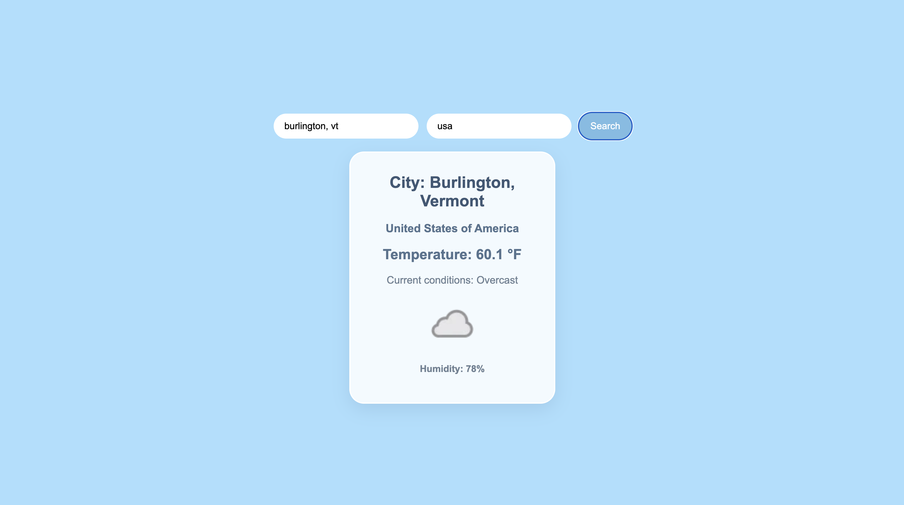

# Weather API

A simple weather application built using HTML, CSS, and JavaScript.

## About

This application allows users to enter a city and country to get the current weather conditions for that location. The project uses a weather API to retrieve and display live weather data based on the user's input.

## Screenshot

## Built With

- HTML
- CSS
- JavaScript
- Weather API

## What I Practiced

- Fetching data from an API
- Working with JSON data
- Using user input in an API request
- DOM manipulation
- Handling errors with API requests
- Displaying API results on the page